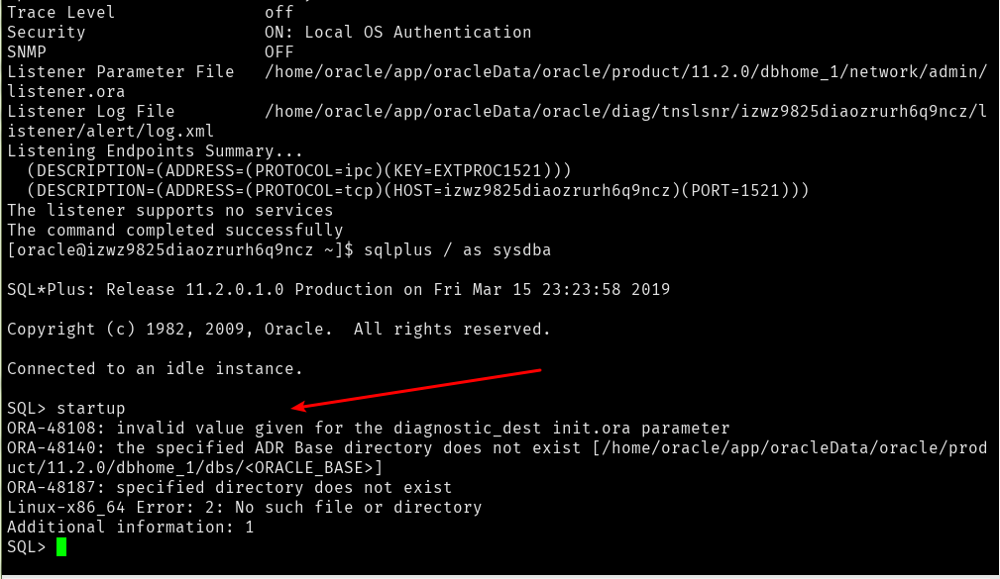

---
title:Centos安装Oracle 11g 
---

[TOC]

## 一、准备工作

### 1.1 安装桌面

安装Oracle使用可视化安装更加方便，因此，需要在centos下安装一个图形化界面：

```shell
#yum -y groupinstall "X Window System" "Chinese Support" "Desktop"
```

注意：命令最前面的`#`一般指的是需要使用root权限来运行的命令；而`$`指的是普通用户执行即可。


#### 1.1.# 关于vncserver的安装

详细参考：[centos 7 安装和配置vncserver](https://www.cnblogs.com/littlemonsters/p/5779331.html)

```shell
# systemctl enable vncserver@:1.service #设置开机启动
# systemctl start vncserver@:1.service #启动vnc会话服务
# systemctl status vncserver@:1.service #查看nvc会话服务状态
# systemctl stop vncserver@:1.service #关闭nvc会话服务
# netstat -lnt | grep 590*      #查看端口
tcp        0      0 0.0.0.0:5901            0.0.0.0:*               LISTEN     
tcp        0      0 0.0.0.0:5901            0.0.0.0:*               LISTEN 
```


卸载图形化界面的方式：

[How to remove GNOME from CentOS 7](https://www.techrepublic.com/article/how-to-remove-gnome-from-centos-7/)


### 1.2 安装前的检查1

#### 1.2.1 检查硬盘分区

命令：

```shell
#df -h
```


#### 1.2.2 检查swap分区大小

此外，还需要检查swap分区

```shell
#fdisk -l
```

Oracle 11g要求系统的swap分区要求至少需要4G才能正常运行；


关于如何增加swap分区的大小：

1. 使用`dd`命令创建创建一个swap交换文件：

   ```shell
   dd if=/dev/zero of=/home/swap bs=1024 count=4165632
   ```

   上面的命令创建了一个`/home/swap`的分区文件，该文件的大小为4G；<font color="red">注意：创建体积大的swap文件可能需要的时间很长！！！</font>
   参数解析可以参考：

   > https://www.cnblogs.com/jikexianfeng/p/6103500.html

1. 制作swap格式文件：

   ```shell
   mkswap /home/swap
   ```

   上面的路径对应了步骤一的输出文件路径；

1. 然后使用`swapon`命令把这个文件分区挂载swap分区:

   ```shell
   /sbin/swapon   /home/swap
   ```

1. 最后查看是否创建交换分区成功：

   ```shell
   free -m
   ```

上面的swap可能因为系统重启而导致swap分区丢失，为了避免每次重启服务器后都需要重新创建swap文件，可以编辑`/etc/fstab`文件：

```shell
vi /etc/fstab
```

在文件末尾添加上：

```
/home/swap swap swap default 0 0
```

这样就能避免由于重启而导致swap分区丢失问题。


#### 1.2.3 同步时钟

这一步并不是必须的，可以跳过。


#### 1.2.4 防火墙设置

需要关闭防火墙：

```shell
# systemctl disable firewalld
```


>另：关于防火墙的操作：
>
>启动：# systemctl start  firewalld
>
>查看状态：# systemctl status firewalld 或者 firewall-cmd --state
>
>停止：# systemctl disable firewalld
>
>禁用：# systemctl stop firewalld
>
>开放防火墙端口：
>
>​	firewall-cmd --zone=public --add-port=80/tcp --permanent
>
>- --zone #作用域
>- --add-port=80/tcp  #添加端口，格式为：端口/通讯协议
>- --permanent   #永久生效，没有此参数重启后失效


### 1.3 Oracle 11g需要的依赖组件包

需要的依赖自检如下：


|                       名称                        | 大小 |
| :-----------------------------------------------: | :--: |
|          libaio-devel-0.3.106-5.i386.rpm          |      |
|        numactl-devel-0.9.8-11.el5.i386.rpm        |      |
|    elfutils-libelf-devel-0.137-3.el5.i386.rpm     |      |
| elfutils-libelf-devel-static-0.137-3.el5.i386.rpm |      |
|           libgomp-4.4.4-13.el5.i386.rpm           |      |
|           libgcc-4.1.2-50.el5.i386.rpm            |      |
|           nscd-2.5-58.el5_6.3.i386.rpm            |      |
|         sysstat-7.0.2-3.el5_5.1.i386.rpm          |      |
|           pdksh-5.2.14-36.el5.i386.rpm            |      |
|       compat-libstdc++-33-3.2.3-61.i386.rpm       |      |
|          libstdc++-4.1.2-50.el5.i386.rpm          |      |
|       glibc-headers-2.5-58.el5_6.3.i386.rpm       |      |
|        unixODBC-devel-2.2.11-7.1.i386.rpm         |      |
|           unixODBC-2.2.11-7.1.i386.rpm            |      |
|    kernel-headers-2.6.18-238.9.1.el5.i386.rpm     |      |
|        glibc-devel-2.5-58.el5_6.3.i386.rpm        |      |
|             cpp-4.1.2-50.el5.i386.rpm             |      |
|       libstdc++-devel-4.1.2-50.el5.i386.rpm       |      |
|           gcc-c++-4.1.2-50.el5.i386.rpm           |      |
|             gcc-4.1.2-50.el5.i386.rpm             |      |
|           glibc-2.5-58.el5_6.3.i686.rpm           |      |
|       glibc-common-2.5-58.el5_6.3.i386.rpm        |      |


组合命令如下：

```shell
yum -y install binutils compat-libstdc++-33 elfutils-libelf elfutils-libelf-devel glibc glibc-common glibc-devel gcc gcc-c++ libaio-devel libaio libgcc libstdc++ libstdc++-devel make sysstat unixODBC unixODBC-devel pdksh numactl-devel glibc-headers
```

> 另：由于centos拥有社区的维护功能，因此，当在centos中安装Oracle时，上面的依赖组件不用自己配置yum源。

当安装完成上面的包后，还需要单独安装以下几个包：

```shell
rpm -ivh pdksh-5.2.14-37.el5_8.1.x86_64.rpm  --force --nodeps 
```

这几个包的下载地址为：

>链接: https://pan.baidu.com/s/1POLarHiCHRCkNSWdTWzqow 提取码: 6666
>
>可以使用工具上传到服务端中


其它安装参考：

>yum install libXp.i686 libXp-devel.i686 libXt.i686 libXt-devel.i686 libXtst.i686 libXtst-devel.i686 make.x86_64 gcc.x86_64 libaio.x86_64 glibc-devel.i686 libgcc.i686
> glibc-devel.x86_64 compat-libstdc++-33 -y
> yum install glibc* gcc* make* compat-db* libstdc* libXp* libXtst* compat-libstdc++* -y
>
> 
>
>yum install binutils-2.* compat-libstdc++-33* elfutils-libelf-0.* elfutils-libelf-devel-* gcc-4.* gcc-c++-4.* glibc-2.* glibc-common-2.* glibc-devel-2.* glibc-headers-2.* ksh-2* libaio-0.* libaio-devel-0.* libgcc-4.* libstdc++-4.* libstdc++-devel-4.* make-3.* sysstat-7.* unixODBC-2.* unixODBC-devel-2.* pdksh*


### 1.4 内核参数调整

修改文件`/etc/sysctl.conf`

```shell
vi /etc/sysctl.conf
```

在文件的最后添加以下内容：

```
fs.file-max = 6815744
kernel.shmall = 2097152
kernel.shmmax = 536870912
kernel.shmmni = 4096
kernel.sem = 250 32000 100 128
net.ipv4.ip_local_port_range = 9000 65500
net.core.rmem_default = 262144
net.core.rmem_max = 4194304
net.core.wmem_default = 262144
net.core.wmem_max = 1048576
fs.aio-max-nr = 1048576
```

修改后的内核参数还没有生效，为了使其生效，需要执行以下命令：

```shell
sysctl -p
```


### 1.5 Oracle参数限制

修改`/etc/security/limits.conf`文件：

```shell
vi /etc/security/limits.conf
```

在文件最后添加以下内容：

```
#oracle settings
oracle soft nproc 16384
oracle hard nproc 16384
oracle soft nofile 65536
oracle hard nofile 65536
```


### 1.6 修改版本号

（Redhat 5.×系列系统略过这步）

1. 修改前先备份：

   ```shell
   cp /etc/redhat-release /etc/redhat-release.bk
   ```

1. 修改文件`/etc/redhat-release`：

   ```shell
   vi /etc/redhat-release
   ```

   添加以下内容：

   ```
   Red Hat Enterprise Linux AS release 5 (Taroon)
   ```


### 1.7 修改登录文件1：

需要修改的登陆文件位置：`/etc/pam.d/login`：

```shell
vi /etc/pam.d/login
```

添加以下内容：

```
session    required     /lib/security/pam_limits.so
session    required     pam_limits.so

```


### 1.8 修改profile文件

需要修改的文件位置：`/etc/profile`：

```shell
vi /etc/profile
```

添加以下内容

```
if [ $USER = "oracle" ]; then
   if [ $SHELL = "/bin/ksh" ]; then
      ulimit -p 16384
      ulimit -n 65536
   else
      ulimit -u 16384 -n 65536
   fi
fi

```

修改此文件并保存后，如果退出root用户，可能出现乱码问题，需要将出现乱码的部分文字删除并修改正确。

修改方法：

1. 将出现问题的文字复制到“记事本”里；
1. 在“记事本”里将所有乱码的部分删除；
1. 最后将修改正确的部分替换原来有问题的部分。


### 1.9 修改登录文件2

需要修改的文件位置：`/etc/csh.login`：

```shell
vi /etc/csh.login
```

添加以下内容

```
if ( $USER == "oracle" ) then
     limit maxproc 16384
     limit deors 65536
endif

```


## 二、创建Oracle用户

### 2.1 创建用户

需要在centos上创建一个用户

```shell
groupadd oinstall 
groupadd dba 
useradd -g oinstall -G dba oracle 
passwd oracle 
```

上面的命令中，最后一个命令的第三个参数指定了密码的值，根据自己的要求填写即可。


### 2.2 创建安装Oracle的目录

```shell
#创建三个目录
mkdir -p /home/oracle/app/oracleData/oracle
mkdir -p /home/oracle/app/oracleData/oralnventory
mkdir -p /home/oracle/app/oracleData/software
# 更改三个目录的所有者
chown -R oracle:oinstall /home/oracle/app/oracleData/oracle
chown -R oracle:oinstall /home/oracle/app/oracleData/software
chown -R oracle:oinstall /home/oracle/app/oracleData/oralnventory

```

因为上面的操作都是在root身份上进行的，因此，需要将创建的目录的所有者修改为oracle用户。


完成上面的操作后，需要退出root用户。


## 三、

切换到刚刚创建的oracle用户：

```shel
su oracle
```


### 3.1 设置用户环境变量

修改文件`.bash_profile`

```shell
$ vi .bash_profile
```

添加以下内容：

```
ORACLE_SID=orcl;
export ORACLE_SID

ORACLE_BASE=/home/oracle/app/oracleData/oracle;
export ORACLE_BASE

ORACLE_HOME=$ORACLE_BASE/product/11.2.0/db_1; 
export ORACLE_HOME

PATH=$PATH:$ORACLE_HOME/bin:$HOME/bin; 
export PATH

```

最后，使环境变量生效：

```shell
$source .bash_profile
```


```shell
su - 用户
```

上面的命令可以在切换用户的时候读环境变量。


## 四、安装vnc viewer并下载oracle 11g安装包


## 五、安装Oracle

安装Oracle的时候，需要使用用户oracle来登陆vncserver！！！！


### 5.1 下载压缩包

下载oracle安装文件到/home/oracle/app/oracleData/software目录下，并解压

解压后得到`database`文件夹。


### 5.2 启动Oracle图形化界面安装

利用vncserver启动远程服务器桌面，并cd进入oracle的database所在目录，在图形化界面中打开终端，并运行runInstall文件。


此后，会出现Oracle安装的图形化界面，按照自己的需求勾选响应的选项即可。

>在选择`/home/oracle/app/oracleData/oralnventory`这个目录时，可能会出现“该文件夹没有写权限”之类的错误，这是Oracle 11g安装包的一个bug。
>
>解决办法：只需要在本界面中重新选择到该目录即可。


注意事项：

1. ~~本次安装Oracle时，第二步的选项按照了视频中的设置：~~
   ~~~~
   ~~而且，在下一步中选择了“服务器类型”的选项。~~

   - ~~这样选择主要是为了在安装Oracle的同时安装数据库。~~


   在安装Oracle软件的同时安装数据库，当服务器内存太小的时候，往往会卡在界面上很久；比较稳妥的办法是：先安装完Oracle软件，然后再利用图形化界面安装数据库。
   在生成数据库的时候，服务器的读写会非常高（主要需要关注“写速度”）：
   
1. 进入安装界面后，可能会出现几种错误，其中错误<font color="red">ins_ctx.mk的错误提示</font>，这个错误可以直接跳过；
   如果出现<font color="red">error in invoking target ‘agent nmhs’ of makefile</font>，请参考第七章；
1. 在安装的过程中，远程服务器可能出现卡死的情况，此时可以登陆服务器后台观察CPU是否在运行来判断进程是否正常。


最后使用root用户执行以下脚本：

```shell
su -
/home/oracle/app/oracleData/oralnventory/orainstRoot.sh
/home/oracle/app/oracleData/oracle/product/11.2.0/db_1/root.sh

```


### 5.# 是否成功的检验

1. 是否正确安装Oracle软件：
   在用户oracle下观察是否能正常启动监听器和是否能进入sqlplus：

   ```shell
   $ lsnrctl start #监听器启动
   
   $ sqlplus / as sysdba #是否能进入sqlplus
   ```

   如果需要停止监听器，那么可以执行以下命令：

   ```shell
   $ lsnrctl stop #监听器停止
   ```

   如果需要退出sqlplus，可以执行以下命令：

   ```shell
   sql> quit
   ```

1. 观察是否能


## 六、编写Oracle开机脚本


## 七、安装过程排错

### 7.1 如果遇到<font color="red">error in invoking target ‘agent nmhs’ of makefile</font>

使用oracle用户执行以下命令：

```shell
$vi $ORACLE_HOME/sysman/lib/ins_emagent.mk
```

在“未编辑状态”中按下`/`，用于寻找关键字：“$(MK_EMAGENT_NMECTL)”

将上面的“`$(MK_EMAGENT_NMECTL)`” 改为：“​`$(MK_EMAGENT_NMECTL) -lnnz11`”


### 7.2 sqlplus能正常启动，但是提示无法找到文件“initorcl.ora”

由于阿里云服务器内存太小，因此，使用图形化界面安装Oracle 11g的时候可能因为内存不够而临时中断。此时，需要重新使用vncserver连接远程图形化界面，并查看是否已经创建完成数据库：

```shell
# su - oracle #切换到oracle用户，并且切换的同时加载环境变量
$ vncserver :1
```

然后，启动本地的vnc viewer登录，查看远程桌面。

在远程桌面中打开命令行界面，并输入：

```shell
$ dbca
```

此时，会启动一个Oracle的数据库管理界面，在此界面中即可查看是否已经安装了数据库。


由于安装过程中断，因此，可能某些启动文件会缺失。如果在启动sqlplus后，输入：

```shell
sqlplus> startup
```

发现提示缺失“initorcl.ora”文件（假设数据库的实例名是$A$，那么会提示init$A$.ora文件缺失），此时，需要生成并编辑“initorcl.ora”文件，该文件的模板在$ORACLE\_HOME/product/11.2.0/dbhome\_1/dbs$文件夹下的init.ora。

在该文件夹下新建一个“initorcl.ora”文件，内容如下：

```
db_name='ORCL'
memory_target=1G
processes = 150
audit_file_dest='/home/oracle/app/oracleData/oracle/admin/orcl/adump'
audit_trail ='db'
db_block_size=8192
db_domain=''
db_recovery_file_dest='/home/oracle/app/oracleData/oracle/flash_recovery_area'
db_recovery_file_dest_size=2G
diagnostic_dest='/home/oracle/app/oracleData/oracle'
dispatchers='(PROTOCOL=TCP) (SERVICE=ORCLXDB)'
open_cursors=300
remote_login_passwordfile='EXCLUSIVE'
undo_tablespace='UNDOTBS1'
# You may want to ensure that control files are created on separate physical
# devices
control_files = (ora_control1, ora_control2)
compatible ='11.2.0'
```

上面第④、⑧、⑩行中`/home/oracle/app/oracleData/oracle`是环境变量中指定的ORACLE_BASE的值。

如果“initorcl.ora”文件的ORACLE_BASE配置错误，会出现以下错误：




### 7.3 启动数据库时出现“MEMORY_TARGET”错误

```
SQL> startup ; 
ORA-00845: MEMORY_TARGET not supported on this system
```

当出现以上错误时，是因为MEMORY_MAX_TARGET 的设置超过了 /dev/shm 的大小。此时，可以将 /dev/shm 的值调整得更大。


操作如下：

1. 查看 /dev/shm 的值；

   ```shell
   $ df -h | grep shm  # 查看
   ```

1. 使用root用户登录，并执行以下命令：

   ```shell
   # mount -o remount,size=1G /dev/shm
   ```

   上面的命令使/dev/shm重新挂载，同时大小为1G；

1. 经过上面的操作后，能顾正常启动数据库了，但是服务器重启后，就需要重新挂载。为了确保操作系统重启之后能生效，需要修改/etc/fstab文件：

   ```shell
   # vi  /etc/fstab 
   ```

   在文件末尾添加以下的语句：

   ```
   tmpfs /dev/shm tmpfs  defaults,size=1G      0 0
   ```

   


## 八、其它参考文章

1. 静默安装Oracle 11g教程：

   > https://www.jianshu.com/p/4bf587bdf95f

1. 如果还需要以静默方式创建数据库，可以参考这篇文章的最后：

   > https://www.jianshu.com/p/9a02306af35e

   其中，静默参数设置的例子如下：

   ```
   dbca 
   -silent 
   -createDatabase 
   -templateName General_Purpose.dbc 
   -gdbname orcl 
   -sid orcl 
   -sysPassword oracle 
   -systemPassword oracle 
   -responseFile NO_VALUE 
   -datafileDestination /app/oracle/oradata/ 
   -redoLogFileSize 50 
   -recoveryAreaDestination /app/oracle/flash_recovery_area 
   -storageType FS 
   -characterSet AL32UTF8 
   -nationalCharacterSet AL16UTF16 
   -sampleSchema false 
   -memoryPercentage 30 
   -totalMemory 4096 
   -databaseType OLTP 
   -emConfiguration NONE
   ```

1. Oracle 9i的安装参考下面的链接：

   > https://www.jianshu.com/p/b2ebca98d80f


Oracle的rpm包的下载地址如下：

> https://oss.oracle.com/projects/compat-oracle/files/RedHat/


